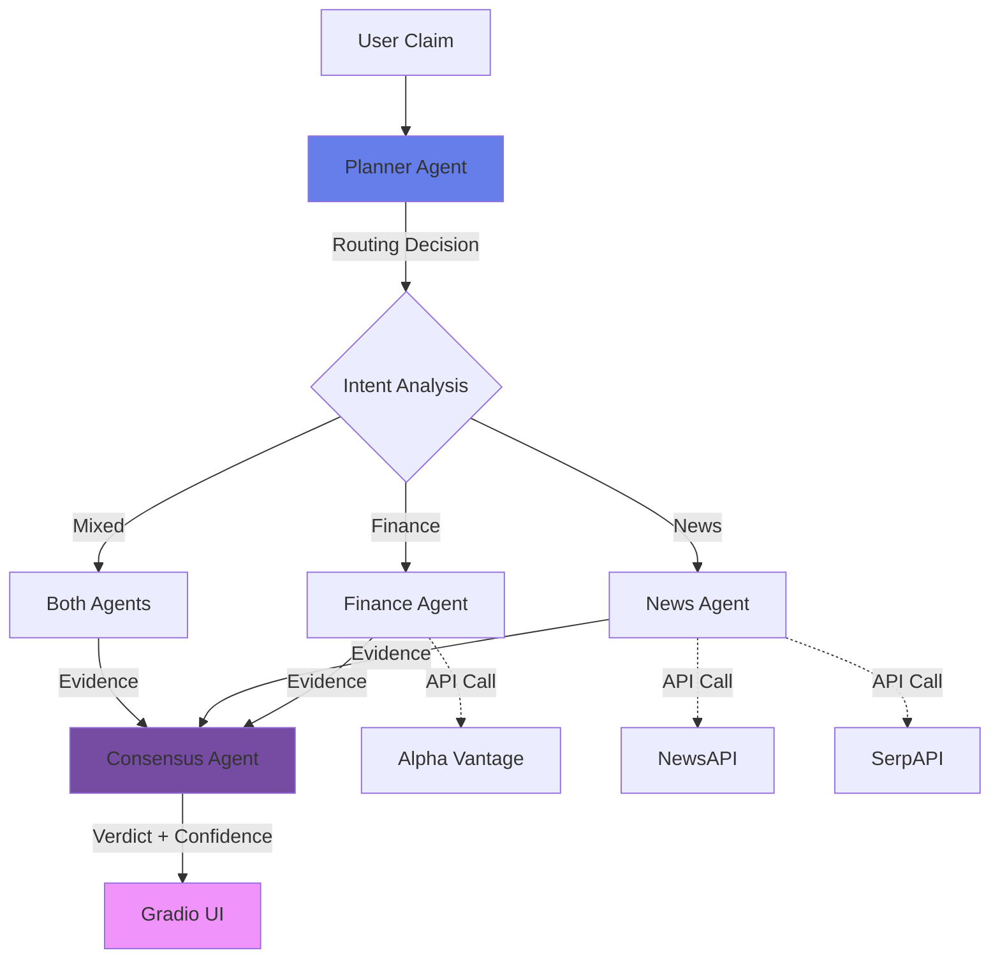

# 🔍 Fact Verification AI Agent System

A production-ready multi-agent fact verification system built with **CrewAI**, **Cerebras AI**, and multiple external APIs. This system intelligently verifies factual claims using specialized AI agents powered by Cerebras' ultra-fast inference and real-time data from trusted sources.


## 🎯 Project Overview

When a user enters a factual claim (e.g., "Gold prices increased yesterday"), the system:

1. **Analyzes** the claim to understand intent and domain
2. **Routes** to appropriate specialized agents (NO hit-and-trial)
3. **Fetches** evidence from trusted APIs (Alpha Vantage, NewsAPI, SerpAPI)
4. **Cross-verifies** sources and detects contradictions
5. **Produces** a human-readable verdict with confidence score
6. **Displays** results in a beautiful, modern UI

## 🏗️ System Architecture



## 🧠 Multi-Agent System

### 1️⃣ Planner Agent (Router)
- **Role**: Analyzes claim intent and domain
- **Output**: Structured routing decision
- **Decides**: Which agents to invoke based on claim classification

### 2️⃣ Finance Agent
- **Role**: Verifies financial claims
- **Data Source**: Alpha Vantage API
- **Capabilities**: Stock prices, commodities (gold, silver), forex rates

### 3️⃣ News Agent
- **Role**: Verifies news and current events
- **Data Sources**: NewsAPI + SerpAPI
- **Capabilities**: Article search, source credibility assessment, date verification

### 4️⃣ Consensus Agent
- **Role**: Synthesizes evidence and produces final verdict
- **Process**: Cross-verification, contradiction detection, confidence scoring
- **Output**: VERIFIED, CONTRADICTED, PARTIALLY TRUE, or UNVERIFIABLE

## 🎨 Confidence-Based Verdict Rules

The Consensus Agent applies these rules:

| Confidence Score | Verdict |
|-----------------|---------|
| ≥ 0.8 | **VERIFIED** (if evidence supports) or **CONTRADICTED** (if evidence refutes) |
| 0.5 - 0.8 | **PARTIALLY TRUE** |
| < 0.5 | **UNVERIFIABLE** |

## 🤖 Why CrewAI?

**CrewAI is used to model independent reasoning agents with defined roles, while routing logic is controlled deterministically to avoid unnecessary execution.**

This hybrid approach provides:
- ✅ **Transparent decision-making**: Router explicitly decides which agents to call
- ✅ **Cost efficiency**: Only necessary APIs are invoked
- ✅ **Specialized expertise**: Each agent has a focused domain
- ✅ **Collaborative reasoning**: Agents work together under orchestrator control

## 📁 Project Structure

```
fact-verification-ai/
│
├── app.py                      # Gradio UI entry point
├── fact_verifier.py            # CrewAI orchestrator with routing logic
├── config.py                   # Environment configuration
├── requirements.txt            # Python dependencies
├── Dockerfile                  # Docker configuration
├── .env.template               # Environment variables template
│
├── agents/
│   ├── planner_agent.py        # Router agent
│   ├── finance_agent.py        # Financial verification agent
│   ├── news_agent.py           # News verification agent
│   └── consensus_agent.py      # Evidence synthesis agent
│
├── tools/
│   ├── alpha_vantage.py        # Stock/commodity data API wrapper
│   ├── news_api.py             # News article API wrapper
│   └── serp_api.py             # Google search API wrapper
│
├── schemas/
│   ├── claim_schema.py         # Input/routing data models
│   └── verdict_schema.py       # Output formatting models
│
└── tests/                      # Unit and integration tests
    ├── test_claim_validation.py
    └── ...
```

## 🧪 Running Tests

To run the test suite, execute the following from the root directory:

```bash
# Run specific test module
python -m tests.test_claim_validation

# or using pytest (if installed)
pytest tests/
```

## 🚀 Quick Start

### Prerequisites

- Python 3.11+
- Docker (optional, for containerized deployment)
- API Keys (see below)

### 1. Clone and Install

```bash
# Navigate to project directory
cd fact-verification-ai

# Install dependencies
pip install -r requirements.txt
```

### 2. Configure API Keys

Create a `.env` file from the template:

```bash
cp .env.template .env
```

Edit `.env` and add your API keys:

```env
CEREBRAS_API_KEY=your_cerebras_api_key_here
LLM_MODEL=gpt-oss-120b
CEREBRAS_BASE_URL=https://api.cerebras.ai/v1
ALPHA_VANTAGE_KEY=your_alpha_vantage_key_here
NEWS_API_KEY=your_news_api_key_here
SERP_API_KEY=your_serp_api_key_here
```

**How to get API keys:**
- **Cerebras**: https://cloud.cerebras.ai/ (Sign up for API access)
- **Alpha Vantage**: https://www.alphavantage.co/support/#api-key
- **NewsAPI**: https://newsapi.org/register
- **SerpAPI**: https://serpapi.com/manage-api-key

### 3. Run Locally

```bash
python app.py
```

Access the UI at: **http://localhost:7860**

### 4. Run with Docker

```bash
# Build the image
docker build -t fact-verifier .

# Run the container
docker run -p 7860:7860 --env-file .env fact-verifier
```

Access the UI at: **http://localhost:7860**

## 💡 Example Claims to Try

| Claim | Expected Domain | Agents Invoked |
|-------|----------------|----------------|
| "Gold prices increased yesterday" | Finance + Time-sensitive | Finance + News |
| "Tesla stock is valued at $200" | Finance | Finance |
| "New climate policy announced in Europe" | News + Time-sensitive | News |
| "Bitcoin surged above $50,000 today" | Finance + News | Finance + News |
| "Apple announced a new product launch" | News | News |

## 📊 Output Format

Results are displayed in **human-readable format** (NO raw JSON):

```markdown
**Verdict:** VERIFIED
**Confidence:** High (0.87)

**Summary:**
Gold price increased by 2.9% on January 18, 2026 according to market data.

**Evidence Sources:**
• **Alpha Vantage** — Market Data
• **Reuters** — News Report
• **Bloomberg** — Financial News

**Notes:** Verification strategy: finance domain
```

## 🔧 Configuration Options

Edit `config.py` or set environment variables:

| Variable | Default | Description |
|----------|---------|-------------|
| `LLM_MODEL` | `gpt-oss-120b` | Cerebras model for agents |
| `LLM_TEMPERATURE` | `0.3` | Temperature for LLM responses |
| `CEREBRAS_BASE_URL` | `https://api.cerebras.ai/v1` | Cerebras API endpoint |
| `HIGH_CONFIDENCE_THRESHOLD` | `0.8` | Threshold for VERIFIED/CONTRADICTED |
| `MEDIUM_CONFIDENCE_THRESHOLD` | `0.5` | Threshold for PARTIALLY TRUE |

## 🛡️ Security Best Practices

- ✅ **Never commit `.env` file** to version control
- ✅ **Use environment variables** for API keys
- ✅ **Rotate API keys** regularly
- ✅ **Monitor API usage** to detect anomalies
- ✅ **Run Docker containers** as non-root user (optional)

## 🐛 Troubleshooting

### Issue: "No module named 'crewai'"
**Solution**: Install dependencies: `pip install -r requirements.txt`

### Issue: "API key not configured"
**Solution**: Check your `.env` file and ensure all keys are set correctly

### Issue: "Rate limit exceeded"
**Solution**: API providers have rate limits. Wait or upgrade your API plan.

### Issue: Gradio UI not loading
**Solution**: Check port 7860 is not in use: `netstat -ano | findstr :7860` (Windows)

## 📝 Development

### Adding a New Agent

1. Create agent file in `agents/` directory
2. Define agent role, goal, and backstory
3. Add tools if needed
4. Update routing logic in `fact_verifier.py`
5. Update `README.md` architecture diagram

### Adding a New API Tool

1. Create tool wrapper in `tools/` directory
2. Implement API client methods
3. Add `@tool` decorator for CrewAI integration
4. Update relevant agent to use the new tool
5. Add API key to `.env.template`

## 📚 Technology Stack

- **CrewAI** (0.30+) - Multi-agent orchestration
- **Cerebras GPT-OSS 120B** - Ultra-fast agent reasoning
- **LangChain** - LLM integration
- **Alpha Vantage** - Financial data
- **NewsAPI** - News articles
- **SerpAPI** - Google search
- **Pydantic** - Data validation
- **Docker** - Containerization

## 🎯 Features

✅ Multi-agent architecture with intelligent routing  
✅ Real-time data from trusted APIs  
✅ Source credibility assessment  
✅ Contradiction detection  
✅ Confidence-based verdict system  
✅ Human-readable output (NO JSON)  
✅ Modern, responsive UI  
✅ Docker support  
✅ Production-ready error handling  
✅ Comprehensive logging  

## 📄 License

This project is provided as-is for educational and commercial use.

## 👨‍💻 Author

Built with ❤️ by a senior AI engineer specializing in multi-agent systems and full-stack development.

---

**🌟 Star this project if you find it useful!**
# factgaurd-ai
# factgaurd-ai
